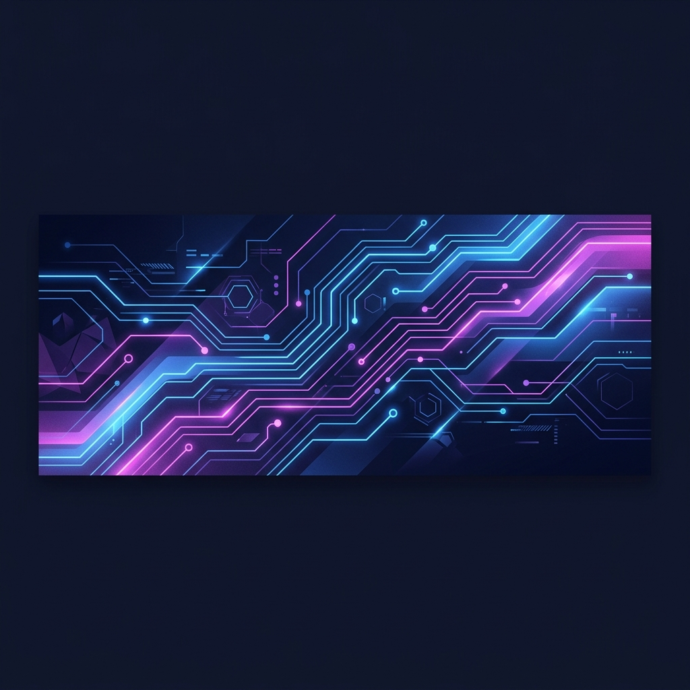

  <!-- If you upload banner.png to your repository root, this relative link will render it beautifully -->
  

<h1 align="center">Hi 👋, I'm Antony George</h1>

  

  
  
  
  

## 🚀 About Me
I am a passionate **Computer Science Student** and **Web Developer** dedicated to building clean, modern, and user-friendly web applications. I love exploring the latest frontend technologies, working with APIs, and learning full-stack development. I am also currently diving deep into **SEO (Search Engine Optimization)** to build web projects that are not only functional but also highly visible and optimized for search.
- 🎓 **Education:** Pursuing a Bachelor's Degree in Computer Science
- 🌱 **Currently Learning:** Next.js, advanced API design, and search engine optimization
- ⚡ **Interests:** Frontend design systems, responsive web design, and full-stack integration
- 💬 **Ask me about:** HTML, CSS, JavaScript, and React styling
 
## 🛠️ Tech Stack
<table width="100%">
  <tr>
    <td valign="top" width="50%">
      <h4>🌐 Frontend Development</h4>
      
      
      
      
      
    </td>
    <td valign="top" width="50%">
      <h4>⚙️ Backend & Databases</h4>
      
      
      
      
      
    </td>
  </tr>
  <tr>
    <td valign="top" width="50%">
      <h4>💻 Programming Languages</h4>
      
      
    </td>
    <td valign="top" width="50%">
      <h4>🛠️ Tools & Platforms</h4>
      
      
      
      
      
    </td>
  </tr>
</table>
 
## 📂 Projects
<table width="100%">
  <tr>
    <td width="50%" valign="top">
      <h3>📦 Project Title One</h3>
      
A modern and responsive web application built to address a specific user need. Describe the key features, architecture, and what makes this project unique.

      

        
        
        
      

      <a href="https://github.com/mamboo108" target="_blank"><b>View Repository ➜</b></a>
    </td>
    <td width="50%" valign="top">
      <h3>📦 Project Title Two</h3>
      
An API-driven dashboard or system that showcases data retrieval, state management, and clean user experience. Optimize it for performance and search discoverability.

      

        
        
        
      

      <a href="https://github.com/mamboo108" target="_blank"><b>View Repository ➜</b></a>
    </td>
  </tr>
</table>
 
## 💼 Experience & Internships
> ### 🚀 Future Internship / Role
> **Company Name** | *Location / Remote*  
> *Duration*  
> - Space reserved for your upcoming professional roles and internships.  
> - Once started, you can list your projects, contributions, and tools used here.
> - Highlight key metrics, performance updates, or responsive designs implemented.
> ### 💻 Independent Developer & Student
> **Self-Directed Projects** | *Learning & Building*  
> *2024 - Present*  
> - Building custom full-stack web applications to hone software engineering skills.
> - Integrating third-party APIs and managing state with React.
> - Exploring SEO techniques to improve organic visibility and indexing of web projects.
 
## 📊 GitHub Stats

  

  
  &nbsp;&nbsp;
  

  

  <i>Made with ❤️ by <a href="https://github.com/mamboo108">Antony George</a></i>

